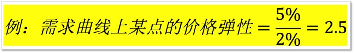

需求第二定律是说：
> 需求对价格的弹性，和价格变化之后流逝的时间长度成正比。也就是说，随着时间的推移，需求对价格的弹性会增加。

我的问题
1. 弹性是什么意思？
2. 需求对价格的弹性指什么？
3. 与流逝时间成正比什么意思？

#1.需求的价格弹性

需求对价格的弹性，就是需求量的变化百分比，除以价格变化的百分比。它的含义是说：每当价格变化百分之一，需求量会变化百分之几。

需求对价格的弹性是一个百分比除以百分比的常数。

需求量的变化率除以价格的变化率除出来，就是一个大于1的常数。弹性大于1，它指的是奢侈品。倒过来，如果1%的价格变化导致的需求量的变化不足1%，那么这时候除出来的弹性数字就小于1。弹性小于1，什么意思呢？它指的是必需品。

#2.需求曲线上的弹性处处不等，价格越高弹性越大

同样一种商品，它究竟是奢侈品还是必需品，没有定数，取决于价格的高低。这是一个很重要的经济学的含义。

#3. 一件商品是奢侈品还是必需品，完全取决于价格

任何商品，都既可以是奢侈品，也可以是必需品，这完全取决于价格的高低。

#今日得到

弹性跟斜率不一样，在一条需求曲线上面，斜率是处处相等的，但是在同样一条需求曲线上面，弹性却处处不等。在价格比较高的部分，弹性大于1，也就是说一种商品具有弹性，代表这种商品是一种奢侈品；在价格比较低的部分，弹性小于1，它代表的是，这种商品是一种必需品。**同样一种商品，到底它是奢侈品还是必需品，取决于价格的不同。**

对于生活中的我们也适用:
> 当一个东西价格高时他就是奢侈品，比如骑车。当价格较低时他就是必需品
> 
> 可是，也有价格高也是必需品的啊，比如房子？
> 这个怎么理解？
