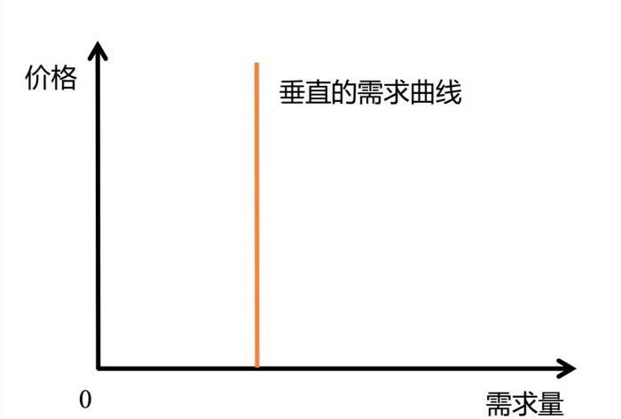

上节课内容**需求的弹性**复习:
> 需求曲线上面的弹性处处不等。也就是说，同样一个需求，当价格比较高的时候，弹性就比较高，意味着这种商品，是一种奢侈品；但是同样一种需求，当价格比较低的时候，弹性就比较小，意味着它是一种必需品。
换句话说，同样一种商品对同样一个人来说，随着价格的变化，它心目中对这个产品的评价也发生了变化。价格高的时候，它就是个奢侈品；价格低的时候，它就变成了必需品。

#1.垂直的需求曲线

垂直的需求曲线表示
> 无论价格多高，需求量都不变，这种需求被成为刚性需求，也就是刚需。

这条需求曲线表示的含义，无论价格多高，需求量都不会发生变化，人们不会寻找替代方案。

#2.人会寻找替代方案

所以，我们说需求定律是刻画人的基本人性的。人性的特点，就在于它能够寻找替代方案。而且随着时间的变化，时间越长，它能找到的替代方案就越多。这是需求定律的含义。

#3. 几千万年不变的人性规律

当人们面对资源稀缺的困难时，一定会寻找替代方案。

#4.随着时间推移，需求弹性会越来越高

需求第二定律的含义是说，每当出现新的情况，出现新的冲击的时候，人们寻找替代方案的范围一开始的时候可能没那么大，但是随着时间的推移，他们选择替代方案的空间会越来越大，他们能够找到的对策就越来越多。

